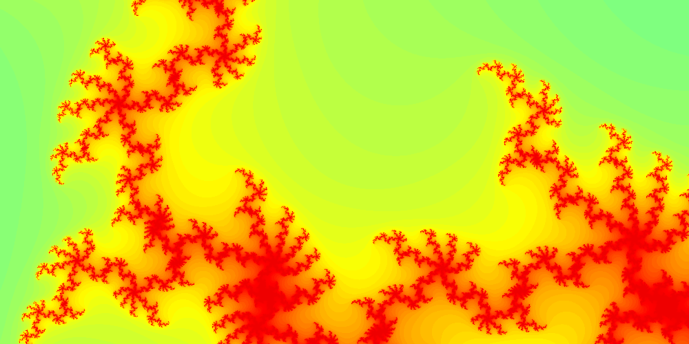

# Progress Bar

So far so good, but now we're taking a long time to generate the image.
In a later section we'll use a lower-level language, and a GPU to speed things up, but for now, let's just add a progress bar to let us know how long we have to wait.

## Progress bar

We can use the `tqdm` library to add a progress bar to our code.

```
poetry add tqdm
```

## Add to area function

Edit the `area()` function in [`mandy/sample.py`](./mandy/sample.py) to look like this:

```python
from tqdm import tqdm # Don't forget to add this to the top of the file.

def area(real, imag, width, height, scale, max_iters):
    re = np.linspace(real - 0.5 * scale * width, real + 0.5 * scale * width, width)
    im = np.linspace(imag - 0.5 * scale * height, imag + 0.5 * scale * height, height)

    mandelbrot_set = np.zeros((height, width))

    for n in tqdm(range(height * width)):
        i = n // width
        j = n % width
        mandelbrot_set[i, j] = point(re[j], im[i], max_iters)

    return mandelbrot_set
```

## Try it

Next time we run the code, we should see a progress bar:

```bash
poetry run python scripts/run.py 0.42884 -0.231345 1000 500 3e-8 100
```

Ride the lightening near $0.42884,-0.231345$:



## Return

[Return to the top-level README](./../../README.md)
